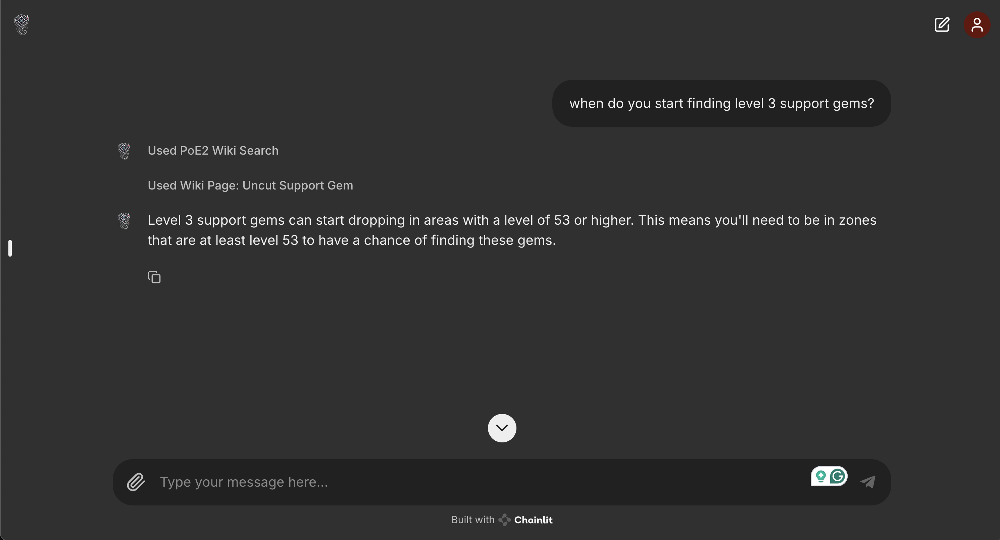

<div align="center">

# Wraeclast Whisperer


</div>

A GPT-powered agent for Path of Exile 2 with up-to-date game data that helps players synergize their builds, create loot filters, answer game-related questions, and more.



## Description

Wraeclast Whisperer is an intelligent agent powered by OpenAI's Assistant API that provides personalized guidance for Path of Exile 2 players. It analyzes current game data and player statistics to offer insights and recommendations. This agent is not intended to create builds for you, but rather aid you on your journey. 

## Features (Planned)

- [x] General game knowledge assistance
- [x] Build optimization suggestions
- [ ] Gear improvement recommendations  
- [ ] Skill gem synergy analysis
- [ ] Custom loot filter generation
- [ ] Real-time build assessment

## Data Sources
- [x] [Official POE2 Wiki](https://www.poe2wiki.net/wiki/Path_of_Exile_2_Wiki)
- [x] Web searches (responsibly -- respects robots.txt and sitemaps)
- [ ] PoE 2 Game Data
- [ ] PoE 2 Api
- [ ] YouTube Transcripts

None of the data mentioned above (except for game data) is stored or used for any other purposes. This data is requested by the user and is only accessible during the user's chat interface session.

## Prerequisites

- [OpenAI API key](https://platform.openai.com/settings/organization/api-keys)
- [Docker](https://www.docker.com/products/docker-desktop/)

## Installation

1. Clone the repository
2. Copy `.env.example` to `.env` and add your OpenAI API key
    ```sh
    cp .env.example .env
    ```
3. Choose your preferred installation method:

**Using Docker**
- Install and run [Docker](https://www.docker.com/products/docker-desktop/), then -
```sh
docker compose up -d;
```
- Navigate to http://localhost:8080/ in your browser

## Development Instructions

**[Using Devcontainer in VSCode](https://code.visualstudio.com/docs/devcontainers/tutorial) (slightly advanced, but fastest method)** 
- Must have [Docker](https://www.docker.com/products/docker-desktop/) installed. 
- Install Extension: https://marketplace.visualstudio.com/items?itemName=ms-vscode-remote.remote-containers
- Use vscode command -- "Dev Containers: Rebuild Container" 

## Login (for the short-term)
Email: admin

Password: admin

## Development Notes

This project uses:

- Poetry for dependency management
- Black for code formatting
- Ruff for linting
- MyPy for type checking
- Chainlit as an LLM framework with UI
- Playwright for rendered web scraping
- Fly.io for deployment

## License

This project is licensed under the MIT License - see the LICENSE file for details.

## Acknowledgments

- Path of Exile 2 and all related content are property of Grinding Gear Games. Go Support them!
- Chainlit
